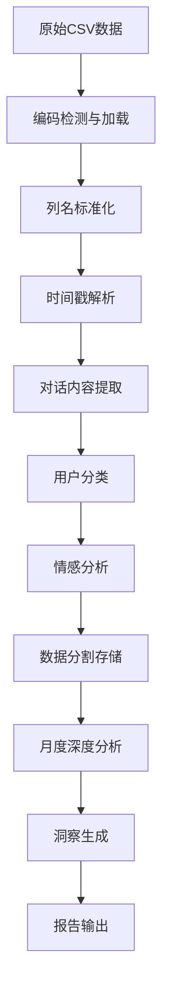

# 小馨宝运营分析系统

[](https://www.python.org/)
[](https://pandas.pydata.org/)
[]()
[]()
[]()

小馨宝AI心理支持服务运营数据智能分析系统，专门用于处理和分析用户与AI助手的对话日志，提取关键运营指标、用户行为模式、情感倾向以及服务痛点，为优化心理支持服务提供精准的数据洞察。

## ⚠️ 重要声明

### 🎯 专用性说明
本系统**专门适用**于以下FastGPT平台工作流项目：
- **小馨宝**: AI心理支持服务平台
- **类似医疗AI助手**: 基于FastGPT构建的专业医疗咨询平台

本分析系统仅适用于处理这类**已脱敏的后台运营数据**，不适用于其他类型的对话数据分析。

### 🔐 数据安全与隐私保护
> **严格遵循医疗数据隐私保护标准**

- **🚫 绝对禁止**: 处理任何包含真实个人身份信息的原始数据
- **✅ 仅处理**: 经过专业脱敏处理的后台运营统计数据
- **🔒 数据脱敏**: 所有用户ID、真实姓名、联系方式等敏感信息必须已被匿名化
- **📋 合规要求**: 符合《个人信息保护法》、《数据安全法》等相关法规
- **🏥 医疗标准**: 遵循医疗行业数据安全和患者隐私保护标准

### ⚡ 开发者责任声明
**在提交PR或分享代码前，开发者必须确保：**

1. **✅ 数据清理检查**: 彻底清理所有测试数据、示例数据中的真实用户信息
2. **✅ 代码审查**: 确认代码中不包含任何硬编码的敏感信息
3. **✅ 日志清理**: 清除开发过程中可能产生的包含用户数据的日志文件
4. **✅ 文档检查**: 确认README、注释中的示例数据均为虚构内容
5. **✅ 配置文件**: 移除任何包含真实数据库连接、API密钥等敏感配置

**违反数据安全要求的PR将被立即拒绝并要求整改。**

## 📋 目录

- [项目概述](#-项目概述)
- [核心功能](#-核心功能)
- [系统架构](#-系统架构)
- [快速开始](#-快速开始)
- [快速配置指南](#️-快速配置指南)
- [部署指南](#-部署指南)
- [数据处理流程](#-数据处理流程)
- [使用指南](#-使用指南)
- [输出说明](#-输出说明)
- [API文档](#-api文档)
- [测试验证](#-测试验证)
- [故障排除](#-故障排除)
- [贡献指南](#-贡献指南)
- [项目适用性总结](#-项目适用性总结)

## 🎯 项目概述

本系统是一个**高度可定制**的运营数据分析平台，最初为"小馨宝"AI心理支持服务设计，现已扩展为通用的AI对话分析工具。通过智能化的数据处理管道，系统能够：

- 🔄 **自动化数据处理**：支持多格式、多编码的原始数据自动识别与清洗
- 📊 **多维度分析**：提供用户分类、情感分析、主题识别等多角度洞察
- 📈 **趋势分析**：月度对比、用户旅程、服务效果评估
- 🎯 **业务洞察**：自动生成可操作的改进建议和服务优化方案
- 📱 **实时监控**：支持增量数据处理和实时指标更新
- 🎨 **高度可定制**：支持不同行业的关键词配置和业务逻辑调整

### 🌟 开源适用性

本系统设计为**行业无关**的通用框架，可以轻松适配不同领域的AI对话分析需求：

#### 🧠 心理支持服务（默认配置）
- **用户分类**：患者家属、志愿者、医疗专业人员
- **情感分析**：关注用户心理状态、情感变化
- **主题识别**：症状管理、情感支持、治疗信息等

#### 🏥 医疗健康服务
- **用户分类**：患者、家属、医生、护士
- **症状分析**：疾病症状、用药咨询、检查报告
- **医疗主题**：诊断信息、治疗方案、康复指导

#### 🏢 企业客服服务
- **用户分类**：客户、客服代表、技术支持
- **问题分类**：产品咨询、技术支持、投诉处理
- **服务质量**：响应时间、解决率、满意度

#### 🎓 教育培训服务
- **用户分类**：学生、教师、家长
- **学习分析**：课程咨询、学习进度、问题解答
- **教学效果**：理解程度、参与度、反馈质量

## ⚡ 核心功能

### 1. 智能数据预处理
- **多编码支持**：自动识别UTF-8、GBK、GB2312、CP936等中文编码
- **列名标准化**：乱码列名自动映射为规范化英文字段
- **时间戳解析**：支持多种时间格式的智能识别与标准化
- **内容提取**：从复杂JSON结构中精确提取中文对话内容
- **数据清洗**：去重、格式化、异常值处理

### 2. 用户行为分析
- **用户分类**：智能识别患者家属、志愿者、医疗专业人员、其他用户（**可自定义关键词**）
- **情感分析**：基于扩展中文情感词汇库的三分类情感识别（**支持行业特定词汇**）
- **行为模式**：用户交互频次、对话长度、活跃时段分析
- **用户旅程**：从首次接触到深度使用的情感变化轨迹

### 3. 服务质量评估
- **主题分析**：症状管理、情感支持、治疗信息、日常护理、家属支持（**支持自定义主题关键词**）
- **痛点识别**：自动发现用户困扰点和服务瓶颈
- **志愿者效果**：评估志愿者参与度、响应质量、服务覆盖率
- **满意度监控**：基于情感变化的服务满意度评估

### 4. 智能决策支持
- **洞察生成**：基于数据阈值的自动业务洞察发现
- **改进建议**：可操作的服务优化和流程改进建议
- **预警机制**：异常指标和风险预警
- **趋势预测**：基于历史数据的趋势分析

### 5. 🎨 行业定制化配置
- **关键词配置**：支持自定义用户分类、情感分析、主题识别的关键词库
- **业务逻辑**：可调整分析算法和阈值，适配不同行业需求
- **输出格式**：支持自定义报告结构和指标计算
- **多语言支持**：内置中文支持，可扩展其他语言

## 🏗️ 系统架构

```
小馨宝运营分析系统
├── 数据输入层
│   ├── input/
│   │   └── chat_logs.csv (原始数据，Fast 平台导出默认文件名)
│   └── 多格式数据源支持
├── 数据处理层
│   ├── data_preprocessor.py (数据预处理)
│   ├── monthly_analyzer.py (月度分析)
│   └── 数据质量保证
├── 分析引擎层
│   ├── 用户分类算法
│   ├── 情感分析引擎
│   ├── 主题识别系统
│   └── 趋势分析模块
├── 输出层
│   ├── JSON格式报告
│   ├── CSV格式数据
│   └── 可视化就绪数据
└── 应用层
    ├── 命令行接口
    ├── 批处理模式
    └── 增量处理模式
```

## 🚀 快速开始

### 先决条件

- Python 3.7 或更高版本
- 8GB 可用内存（推荐）
- 1GB 可用磁盘空间

### 🎯 一键部署（推荐）

```bash
# 1. 克隆项目
git clone <repository-url>
cd 小馨宝运营分析

conda create -n fast-GPT-analyzer python=3.11
conda activate fast-GPT-analyzer

# 2. 安装依赖
pip install -r requirements.txt

# 3. 准备数据（Fast 平台导出）
# 将导出的 chat_logs.csv 放在 input/ 目录

# 4. 运行完整分析（推荐）

## 配置llm
cp env.example .env
## 运行分析
python run_analysis.py --full
# 🤖 启用AI分析（需要配置DeepSeek API）
python run_analysis.py --full --ai --ai-stream
# 🤖 启用AI分析（lmstudio模式，配置具体模型,记得模型配置提供足够的token窗口，推荐8192）
python run_analysis.py --full --ai --ai-model lmstudio --ai-stream

```

### 📖 常用命令速查

```bash
# 🔍 查看帮助
python run_analysis.py --help

# 📊 完整分析流程（推荐）
python run_analysis.py --full

# 🔄 仅数据预处理
python run_analysis.py --preprocess

# 📈 仅月度分析
python run_analysis.py --analyze-monthly

# 🤖 启用AI分析（需要配置DeepSeek API）
python run_analysis.py --full --ai --ai-stream

# 📁 自定义输入文件
python run_analysis.py --input-file custom_data.csv --full

# 📂 自定义输出目录
python run_analysis.py --output-dir custom_output --report-dir custom_reports --full
```

### 🧪 验证安装

```bash
# 运行测试验证系统完整性
python test_data_processing.py
python unit_tests.py
```

## ⚙️ 快速配置指南

### 🎯 适配不同行业的快速配置

本系统支持通过修改配置文件来快速适配不同行业，无需修改核心代码：

> v0.3 起，推荐通过 .env 配置关键词（无需修改代码）。下述代码级示例仍可作为参考。

#### 1A. 通过 .env 配置关键词（推荐，自 v0.3）

```bash
# 用户分类（JSON 优先）
USER_CATEGORY_KEYWORDS={"patient_family":["患者","病人","家属","家人"],"volunteer":["志愿者","志愿","帮助"],"medical_professional":["医生","医师","护士"]}
# 或逗号分隔：PATIENT_KEYWORDS / VOLUNTEER_KEYWORDS / MEDICAL_KEYWORDS

# 情感词库（JSON 优先）
SENTIMENT_WORDS={"positive":["谢谢","感谢","帮助"],"negative":["担心","害怕","痛苦"],"neutral":["咨询","询问","了解"]}
# 或逗号分隔：POSITIVE_WORDS / NEGATIVE_WORDS / NEUTRAL_WORDS

# 主题识别（JSON）
CONVERSATION_THEMES={"symptom_management":["症状","疼痛"],"emotional_support":["担心","害怕"],"treatment_info":["治疗","用药"]}
```

程序读取顺序：JSON 环境变量 > 逗号分隔环境变量 > 代码内置默认。

#### 1B. 用户分类关键词配置（代码级示例）

```python
# 在 data_preprocessor.py 中修改以下关键词列表

# 🧠 心理支持服务（默认）
patient_keywords = ['患者', '病人', '家属', '家人', '确诊', '化疗', '放疗', '手术', '癌症', '肿瘤']
volunteer_keywords = ['志愿者', '志愿', '帮助', '陪伴', '支持', '倾听', '服务', '援助']
medical_keywords = ['医生', '医师', '护士', '专业', '医疗', '临床', '诊断', '用药', '医院']

# 🏥 医疗健康服务
# patient_keywords = ['患者', '病人', '家属', '症状', '诊断', '治疗', '用药', '检查', '康复']
# doctor_keywords = ['医生', '医师', '专家', '主任', '主治', '住院医', '实习医']
# nurse_keywords = ['护士', '护师', '护理', '护士长', '专科护士']

# 🏢 企业客服服务
# customer_keywords = ['客户', '用户', '消费者', '购买', '咨询', '投诉', '建议']
# service_keywords = ['客服', '服务', '支持', '帮助', '解答', '处理']
# technical_keywords = ['技术', '工程师', '专家', '故障', '问题', '修复']

# 🎓 教育培训服务
# student_keywords = ['学生', '学员', '同学', '学习', '课程', '作业', '考试']
# teacher_keywords = ['老师', '教师', '导师', '教授', '讲师', '教学', '指导']
# parent_keywords = ['家长', '父母', '监护人', '关心', '了解', '沟通']
```

#### 2. 情感分析词汇配置

```python
# 在 data_preprocessor.py 中修改情感词汇库

# 🧠 心理支持服务（默认）
positive_words = ['谢谢', '感谢', '帮助', '有用', '好', '棒', '专业', '安慰', '支持', '鼓励', '温暖', '理解', '陪伴', '放心', '舒服', '开心', '满意', '赞']
negative_words = ['担心', '害怕', '痛苦', '难受', '焦虑', '不好', '没用', '绝望', '沮丧', '恐惧', '抑郁', '烦躁', '失望', '无助', '孤独', '崩溃', '压抑']
neutral_words = ['咨询', '询问', '了解', '知道', '请教', '想问', '如何', '什么', '怎么']

# 🏥 医疗健康服务
# positive_words = ['好转', '康复', '治愈', '有效', '改善', '缓解', '稳定', '正常', '健康']
# negative_words = ['疼痛', '不适', '恶化', '严重', '危险', '紧急', '并发症', '副作用', '耐药']
# neutral_words = ['检查', '诊断', '治疗', '用药', '复查', '随访', '观察']

# 🏢 企业客服服务
# positive_words = ['满意', '好评', '推荐', '解决', '快速', '专业', '贴心', '周到', '感谢']
# negative_words = ['不满', '投诉', '差评', '慢', '差', '敷衍', '推诿', '态度差', '失望']
# neutral_words = ['咨询', '了解', '询问', '处理', '跟进', '反馈', '建议']
```

#### 3. 主题识别配置

```python
# 在 monthly_analyzer.py 中修改主题关键词

# 🧠 心理支持服务（默认）
conversation_themes = {
    'symptom_management': ['症状', '疼痛', '不适', '感觉', '表现', '反应'],
    'emotional_support': ['情感', '心情', '情绪', '心理', '安慰', '支持', '陪伴'],
    'treatment_info': ['治疗', '用药', '手术', '化疗', '放疗', '康复'],
    'daily_care': ['护理', '照顾', '生活', '饮食', '运动', '休息'],
    'family_support': ['家属', '家人', '陪伴', '关心', '理解', '支持']
}

# 🏥 医疗健康服务
# conversation_themes = {
#     'diagnosis': ['诊断', '检查', '化验', '影像', '病理', '确诊'],
#     'treatment': ['治疗', '用药', '手术', '康复', '理疗', '中医'],
#     'prevention': ['预防', '保健', '体检', '疫苗', '筛查', '早期'],
#     'complications': ['并发症', '副作用', '风险', '注意事项', '禁忌'],
#     'follow_up': ['随访', '复查', '监测', '调整', '评估']
# }

# 🏢 企业客服服务
# conversation_themes = {
#     'product_inquiry': ['产品', '功能', '价格', '规格', '比较', '推荐'],
#     'technical_support': ['技术', '故障', '问题', '错误', '修复', '升级'],
#     'order_service': ['订单', '支付', '物流', '退换', '发票', '售后'],
#     'complaint_handling': ['投诉', '不满', '问题', '处理', '解决', '赔偿'],
#     'suggestion_feedback': ['建议', '反馈', '意见', '改进', '优化', '新功能']
# }
```

### 🔧 高级定制化

对于更复杂的定制需求，可以：

1. **继承核心类**：创建自定义的数据处理器和分析器
2. **插件化架构**：通过配置文件加载不同的分析模块
3. **API扩展**：添加新的分析方法和指标计算
4. **可视化定制**：自定义图表和报告模板

## 📦 部署指南

### 环境配置

#### 1. Python环境

```bash
# 检查Python版本
python --version  # 确保 >= 3.7

# 创建虚拟环境（推荐）
python -m venv venv
source venv/bin/activate  # Linux/Mac
# 或
venv\Scripts\activate     # Windows
```

#### 2. 依赖安装

创建 `requirements.txt` 文件：

```txt
pandas>=1.3.0
numpy>=1.21.0
```

安装依赖：

```bash
pip install -r requirements.txt
```

#### 3. 目录结构准备

```bash
# 创建必要目录
mkdir -p processed_data
mkdir -p logs
mkdir -p backups
```

### 数据准备

#### ⚠️ 数据安全要求（必须遵循）

**🔐 数据脱敏标准：**
- **用户ID**: 必须使用匿名化ID（如：user_001, anonymous_123）
- **对话内容**: 移除所有真实姓名、地址、电话、身份证等个人信息
- **时间戳**: 可保留时间格式，但建议模糊化具体时间点
- **地理信息**: 移除具体地址，可保留省市级别
- **医疗信息**: 敏感疾病名称建议用代码或分类替代

**🚫 绝对禁止包含的信息：**
- 真实姓名、昵称
- 手机号码、身份证号
- 具体地址、医院名称
- 真实的用户ID或session ID
- 任何可追溯到真实个人的标识符

#### 输入数据格式

系统要求输入数据为**已脱敏**的CSV格式，默认文件名为 `input/chat_logs.csv`（兼容 `input/filtered_data.csv`），包含以下列：

| 列名 | 说明 | 脱敏示例 |
|------|------|----------|
| 时间 | 对话时间戳 | 2025/7/28 14:32 |
| 来源 | 数据来源 | 外部接入单点 |
| 使用者 | 匿名用户ID | anonymous_001 |
| 对话详情 | 脱敏JSON格式对话内容 | [{"type":"text","content":"患者咨询症状"}] |

#### 数据质量要求

- **编码**：支持UTF-8、GBK、GB2312、CP936
- **大小**：建议单文件不超过100MB
- **格式**：标准CSV格式，逗号分隔
- **内容**：对话详情需为有效JSON格式
- **脱敏**：所有敏感信息必须已完成专业脱敏处理
- **合规**：符合相关数据保护法规要求

### 生产环境部署

#### 1. 服务器配置

```bash
# 最小配置
CPU: 2核
内存: 4GB
存储: 10GB SSD

# 推荐配置
CPU: 4核
内存: 8GB
存储: 50GB SSD
```

#### 2. 定时任务配置

```bash
# 添加到crontab，每日凌晨2点执行
0 2 * * * cd /path/to/project && python run_analysis.py --full >> logs/analysis.log 2>&1
```

#### 3. 监控配置

```bash
# 创建监控脚本
cat > monitor.sh << 'EOF'
#!/bin/bash
LOGFILE="logs/analysis.log"
if [ ! -f "$LOGFILE" ]; then
    echo "Warning: Log file not found"
    exit 1
fi

# 检查最近一次执行状态
if tail -n 10 "$LOGFILE" | grep -q "分析完成"; then
    echo "Analysis completed successfully"
    exit 0
else
    echo "Analysis may have failed"
    exit 1
fi
EOF

chmod +x monitor.sh
```

## 🔄 数据处理流程

### 完整处理流程图



### 处理步骤详解

#### 1. 数据加载阶段 (data_preprocessor.py)

```python
# 自动编码检测
encodings = ['utf-8', 'gbk', 'gb2312', 'cp936']
for encoding in encodings:
    try:
        df = pd.read_csv(file_path, encoding=encoding)
        break
    except UnicodeDecodeError:
        continue
```

**处理内容**：
- 多编码格式自动检测
- 乱码字符修复
- 数据完整性验证

#### 2. 数据清洗阶段

```python
# 列名标准化映射
standard_columns = [
    'timestamp', 'source', 'user_id', 'contact_type', 
    'title', 'message_type', 'user_agreement', 'user_reply',
    'auto_reply', 'notes', 'dialogue_content'
]
```

**处理内容**：
- 列名规范化
- 数据类型转换
- 缺失值处理

#### 3. 内容提取阶段

```python
# JSON对话内容提取
content_pattern = r'"content"\s*:\s*"([^"]*)"'
content_matches = re.findall(content_pattern, text)
```

**处理内容**：
- JSON格式解析
- 中文文本提取
- 特殊字符清理

#### 4. 智能分析阶段 (monthly_analyzer.py)

**用户分类算法**：
```python
# 关键词匹配算法
patient_keywords = ['患者', '病人', '家属', '家人', '确诊', '化疗', ...]
volunteer_keywords = ['志愿者', '志愿', '帮助', '陪伴', '支持', ...]
medical_keywords = ['医生', '医师', '护士', '专业', '医疗', ...]
```

**情感分析引擎**：
```python
# 情感词汇库
positive_words = ['谢谢', '感谢', '帮助', '有用', '好', '棒', ...]
negative_words = ['担心', '害怕', '痛苦', '难受', '焦虑', ...]
neutral_words = ['咨询', '询问', '了解', '知道', '请教', ...]
```

## 📖 使用指南

### 🚀 快速上手

#### 1. 基础分析流程

```bash
# 最简单的使用方式（推荐新手）
python run_analysis.py --full
```

#### 2. 分步骤执行

```bash
# 步骤1：数据预处理
python run_analysis.py --preprocess

# 步骤2：月度分析
python run_analysis.py --analyze-monthly

# 步骤3：完整流程（包含前两步）
python run_analysis.py --full
```

### 🔧 命令行接口详解

#### 基本用法

```bash
# 显示帮助信息
python run_analysis.py --help

# 完整分析流程（推荐）
python run_analysis.py --full

# 仅数据预处理
python run_analysis.py --preprocess

# 仅月度分析
python run_analysis.py --analyze-monthly
```

#### 高级选项

```bash
# 指定输入文件（默认自动寻找 input/chat_logs.csv）
python run_analysis.py --input-file custom_data.csv --full

# 指定预处理输出目录（默认 processed_data）
python run_analysis.py --output-dir custom_output --full

# 指定 Markdown 报告目录（默认 output/analysis_report.md）
python run_analysis.py --report-dir reports --full
```

#### AI分析功能

```bash
# 启用AI分析（需要配置DeepSeek API）
python run_analysis.py --full --ai

# 启用流式输出，实时查看AI生成过程
python run_analysis.py --full --ai --ai-stream

# 自定义AI分析参数
python run_analysis.py --full --ai --ai-model deepseek-chat --ai-timeout 120 --ai-base-url https://api.deepseek.com/v1

# ========================
# 本地 LMStudio 端点示例
# ========================
# 方法1：使用环境变量配置（推荐）
# 1) 配置 .env 文件：
#    LMSTUDIO_BASE_URL=http://localhost:1234/v1
#    LMSTUDIO_MODEL_NAME=deepseek-r1-distill-llama-8b@q8_0
#    LMSTUDIO_TIMEOUT_SEC=180
#    LMSTUDIO_MAX_TOKENS=4096      # 模型上下文窗口限制
#    LMSTUDIO_CHUNK_SIZE=3000      # 分块处理大小（留出输出空间）
# 2) 运行分析
python run_analysis.py --full --ai --ai-model lmstudio --ai-stream

# 方法2：命令行直接指定（示例模型：deepseek-r1-distill-qwen-7b）
python run_analysis.py --full --ai \
  --ai-model deepseek-r1-distill-qwen-7b \
  --ai-base-url http://localhost:1234/v1 \
  --ai-timeout 180 \
  --ai-stream
```

### Python API使用

#### 数据预处理

```python
from data_preprocessor import XiaoXinBaoDataProcessor

# 初始化处理器
processor = XiaoXinBaoDataProcessor("input/filtered_data.csv")

# 执行预处理
if processor.load_data():
    processor.clean_column_names()
    processor.parse_timestamp()
    processor.extract_dialogue_content()
    processor.categorize_users()
    processor.analyze_sentiment()
    
    # 保存结果
    summary = processor.save_processed_data("processed_data")
    print("处理完成:", summary)
```

#### 月度分析

```python
from monthly_analyzer import MonthlyAnalyzer
import pandas as pd

# 加载月度数据
month_data = pd.read_csv("processed_data/data_2025-07.csv")

# 执行分析
analyzer = MonthlyAnalyzer(month_data)
report = analyzer.comprehensive_analysis()

# 查看结果
print("基础指标:", report['basic_metrics'])
print("主要洞察:", report['insights'])
print("改进建议:", report['recommendations'])
```

### 批量处理模式

```python
# 批量处理多个文件
import glob
from pathlib import Path

data_files = glob.glob("data/*.csv")
for file_path in data_files:
    processor = XiaoXinBaoDataProcessor(file_path)
    if processor.load_data():
        # 执行处理...
        output_dir = f"processed_data/{Path(file_path).stem}"
        processor.save_processed_data(output_dir)
```

## 📊 输出说明

### 目录结构

```
processed_data/
├── cleaned_data.csv              # 完整清洗后数据
├── data_2025-06.csv             # 按月分割数据
├── data_2025-07.csv
├── data_2025-08.csv
├── report_2025-06.json          # 月度分析报告
├── report_2025-07.json
├── report_2025-08.json
├── summary.json                  # 整体数据摘要
└── quarterly_summary.json       # 季度汇总报告
```

```
output/
└── analysis_report.md           # Markdown 汇总报告（新）
```

### 数据文件格式

#### cleaned_data.csv
完整的清洗后数据，包含以下标准化列：

| 列名 | 类型 | 说明 |
|------|------|------|
| timestamp | datetime | 标准化时间戳 |
| source | string | 数据来源 |
| user_id | string | 用户唯一标识 |
| clean_dialogue | string | 清洗后对话内容 |
| user_type | string | 用户类型分类 |
| sentiment | string | 情感分析结果 |
| year_month | period | 年月标识 |

#### 月度数据文件 (data_YYYY-MM.csv)
按月份分割的数据，格式与cleaned_data.csv相同。

### 分析报告格式

#### 月度报告 (report_YYYY-MM.json)

```json
{
  "month": "2025-07",
  "basic_metrics": {
    "total_dialogues": 27,
    "unique_users": 15,
    "avg_dialogue_length": 2335.48,
    "date_range": {
      "start": "2025-07-01 10:00:00",
      "end": "2025-07-31 18:30:00"
    }
  },
  "conversation_themes": {
    "symptom_management": 45,
    "emotional_support": 96,
    "treatment_info": 38,
    "daily_care": 62,
    "family_support": 114
  },
  "user_journey": {
    "first_interaction_sentiment": {
      "positive": 24,
      "neutral": 2,
      "negative": 1
    },
    "last_interaction_sentiment": {
      "positive": 24,
      "neutral": 2,
      "negative": 1
    }
  },
  "pain_points": [
    {
      "indicator": "等",
      "count": 24,
      "examples": ["等待回复中...", "等了很久没有回应", "等待专业建议"]
    }
  ],
  "volunteer_effectiveness": {
    "total_volunteer_sessions": 12,
    "avg_volunteer_messages_per_session": 1.5,
    "volunteer_response_time": "N/A"
  },
  "insights": [
    "本月用户最关注的问题是：family support",
    "用户最大痛点是：等，出现了24次"
  ],
  "recommendations": [
    "建议增加症状管理的标准化回复模板",
    "建议培训更多心理咨询志愿者",
    "优化响应时间，考虑增加智能回复功能"
  ]
}
```

#### 数据摘要 (summary.json)

```json
{
  "total_records": 46,
  "date_range": {
    "start": "2025-06-15 14:32:00",
    "end": "2025-08-15 10:15:00"
  },
  "user_type_distribution": {
    "volunteer": 23,
    "patient_family": 21,
    "medical_professional": 1,
    "other": 1
  },
  "sentiment_distribution": {
    "positive": 41,
    "neutral": 3,
    "negative": 2
  },
  "monthly_counts": {
    "2025-06": 17,
    "2025-07": 27,
    "2025-08": 2
  }
}
```

### 关键指标说明

#### 基础指标
- **total_dialogues**: 总对话数量
- **unique_users**: 唯一用户数
- **avg_dialogue_length**: 平均对话长度（字符数）
- **date_range**: 数据时间范围

#### 主题分析
- **symptom_management**: 症状管理相关讨论次数
- **emotional_support**: 情感支持相关讨论次数
- **treatment_info**: 治疗信息相关讨论次数
- **daily_care**: 日常护理相关讨论次数
- **family_support**: 家属支持相关讨论次数

#### 用户分类
- **patient_family**: 患者或家属
- **volunteer**: 志愿者
- **medical_professional**: 医疗专业人员
- **other**: 其他类型用户

#### 情感分析
- **positive**: 正面情感（感谢、满意、赞赏等）
- **negative**: 负面情感（担心、焦虑、不满等）
- **neutral**: 中性情感（咨询、询问、陈述等）

## 🔧 API文档

### 核心类和方法

#### XiaoXinBaoDataProcessor

```python
class XiaoXinBaoDataProcessor:
    """数据预处理器主类"""
    
    def __init__(self, file_path: str):
        """初始化处理器
        
        Args:
            file_path: CSV文件路径
        """
    
    def load_data(self) -> bool:
        """加载数据
        
        Returns:
            bool: 加载成功返回True
        """
    
    def clean_column_names(self) -> List[str]:
        """清理列名
        
        Returns:
            List[str]: 标准化后的列名列表
        """
    
    def parse_timestamp(self) -> int:
        """解析时间戳
        
        Returns:
            int: 成功解析的时间戳数量
        """
    
    def extract_dialogue_content(self) -> float:
        """提取对话内容
        
        Returns:
            float: 平均对话长度
        """
    
    def categorize_users(self) -> Dict[str, int]:
        """用户分类
        
        Returns:
            Dict[str, int]: 用户类型分布
        """
    
    def analyze_sentiment(self) -> Dict[str, int]:
        """情感分析
        
        Returns:
            Dict[str, int]: 情感分布
        """
    
    def save_processed_data(self, output_dir: str) -> Dict:
        """保存处理结果
        
        Args:
            output_dir: 输出目录
            
        Returns:
            Dict: 处理摘要
        """
```

#### MonthlyAnalyzer

```python
class MonthlyAnalyzer:
    """月度分析器主类"""
    
    def __init__(self, month_data: pd.DataFrame):
        """初始化分析器
        
        Args:
            month_data: 月度数据DataFrame
        """
    
    def basic_metrics(self) -> Dict:
        """计算基础指标
        
        Returns:
            Dict: 基础指标字典
        """
    
    def conversation_analysis(self) -> Dict[str, int]:
        """对话主题分析
        
        Returns:
            Dict[str, int]: 主题统计
        """
    
    def user_journey_analysis(self) -> Dict:
        """用户旅程分析
        
        Returns:
            Dict: 用户旅程数据
        """
    
    def pain_points_identification(self) -> List[Dict]:
        """痛点识别
        
        Returns:
            List[Dict]: 痛点列表
        """
    
    def comprehensive_analysis(self) -> Dict:
        """综合分析
        
        Returns:
            Dict: 完整分析报告
        """
```

### 工具函数

#### convert_numpy_types

```python
def convert_numpy_types(obj) -> Any:
    """转换numpy类型为Python原生类型
    
    Args:
        obj: 待转换对象
        
    Returns:
        Any: 转换后的对象
    """
```

#### process_all_months

```python
def process_all_months(input_dir: str) -> List[Dict]:
    """批量处理所有月份数据
    
    Args:
        input_dir: 输入目录路径
        
    Returns:
        List[Dict]: 所有月份的分析报告列表
    """
```

### 配置选项

#### 用户分类关键词

```python
# 患者家属关键词
patient_keywords = [
    '患者', '病人', '家属', '家人', '老公', '老婆', 
    '妈妈', '爸爸', '儿子', '女儿', '确诊', '化疗', 
    '放疗', '手术', '癌症', '肿瘤', '检查', '治疗'
]

# 志愿者关键词  
volunteer_keywords = [
    '志愿者', '志愿', '帮助', '陪伴', '支持', 
    '倾听', '服务', '援助'
]

# 医疗专业人员关键词
medical_keywords = [
    '医生', '医师', '护士', '专业', '医疗', 
    '临床', '诊断', '用药', '医院'
]
```

#### 情感分析词汇库

```python
# 正面情感词汇
positive_words = [
    '谢谢', '感谢', '帮助', '有用', '好', '棒', 
    '专业', '安慰', '支持', '鼓励', '温暖', '理解', 
    '陪伴', '放心', '舒服', '开心', '满意', '赞'
]

# 负面情感词汇
negative_words = [
    '担心', '害怕', '痛苦', '难受', '焦虑', '不好', 
    '没用', '绝望', '沮丧', '恐惧', '抑郁', '烦躁', 
    '失望', '无助', '孤独', '崩溃', '压抑'
]

# 中性情感词汇
neutral_words = [
    '咨询', '询问', '了解', '知道', '请教', 
    '想问', '如何', '什么', '怎么'
]
```

## 🧪 测试验证

### 测试套件

项目包含完整的测试套件，确保代码质量和功能正确性：

#### 1. 功能测试 (test_data_processing.py)

```bash
python test_data_processing.py
```

**测试内容**：
- 数据加载测试
- 列名清理测试  
- 时间戳解析测试
- 对话内容提取测试
- 用户分类测试
- 情感分析测试
- 月度分割测试
- 月度分析测试
- JSON序列化测试

**预期输出**：
```
=== 测试总结 ===
通过: 9/9
成功率: 100.0%
🎉 所有测试通过！数据处理管道正常工作。
```

#### 2. 单元测试 (unit_tests.py)

```bash
python unit_tests.py
```

**测试覆盖**：
- `TestDataPreprocessor`: 数据预处理器测试
- `TestMonthlyAnalyzer`: 月度分析器测试
- `TestConvertNumpyTypes`: 类型转换测试
- `TestEndToEnd`: 端到端测试

**测试用例**：
- 16个单元测试用例
- 模拟数据测试
- 边界条件测试
- 异常处理测试

#### 3. 性能测试

```python
# 性能基准测试
import time

def performance_test():
    start_time = time.time()
    
    # 执行完整分析流程
    processor = XiaoXinBaoDataProcessor("test_data.csv")
    processor.load_data()
    # ... 其他处理步骤
    
    end_time = time.time()
    print(f"处理耗时: {end_time - start_time:.2f}秒")
```

### 测试数据

#### 创建测试数据

```python
# 生成测试CSV数据
test_data = """时间,来源,使用者,联系方式,标题,消息总数,用户赞同反馈,用户反对反馈,自定义反馈,标注答案,对话详情
2025/7/28 14:32,外部接入,user1,'-,测试,1,[],[],[],[],"[{""type"":""text"",""text"":{""content"":""我是癌症患者家属，很担心""}}]"
2025/7/29 15:30,外部接入,user2,'-,测试,1,[],[],[],[],"[{""type"":""text"",""text"":{""content"":""谢谢志愿者的帮助和陪伴""}}]"
"""

with open("test_data.csv", "w", encoding="utf-8") as f:
    f.write(test_data)
```

### 质量保证流程

#### 1. 代码规范检查

```bash
# 使用pylint检查代码质量
pylint data_preprocessor.py
pylint monthly_analyzer.py
pylint run_analysis.py

# 使用black格式化代码
black *.py
```

#### 2. 数据质量验证

```python
def validate_data_quality(df):
    """数据质量验证"""
    issues = []
    
    # 检查必需列
    required_cols = ['timestamp', 'user_id', 'clean_dialogue']
    for col in required_cols:
        if col not in df.columns:
            issues.append(f"缺少必需列: {col}")
    
    # 检查数据完整性
    if df['timestamp'].isna().any():
        issues.append("存在空时间戳")
    
    if df['clean_dialogue'].str.len().mean() < 10:
        issues.append("对话内容过短，可能提取失败")
    
    return issues
```

#### 3. 结果验证

```python
def validate_analysis_results(report):
    """分析结果验证"""
    assert 'basic_metrics' in report
    assert 'insights' in report
    assert 'recommendations' in report
    
    # 验证指标合理性
    metrics = report['basic_metrics']
    assert metrics['total_dialogues'] > 0
    assert metrics['avg_dialogue_length'] > 0
    
    print("分析结果验证通过")
```

## ❗ 故障排除

### 常见问题和解决方案

#### 1. 数据加载失败

**问题**: UnicodeDecodeError: 'utf-8' codec can't decode byte

**解决方案**:
```python
# 系统会自动尝试多种编码，如果仍然失败：
# 1. 检查文件编码
file -i input/filtered_data.csv

# 2. 手动转换编码
iconv -f gbk -t utf-8 input/filtered_data.csv > input/filtered_data_utf8.csv

# 3. 使用记事本另存为UTF-8格式
```

#### 2. JSON序列化错误

**问题**: TypeError: Object of type 'int64' is not JSON serializable

**解决方案**:
```python
# 系统已内置convert_numpy_types函数解决此问题
# 如果仍有问题，手动转换：
import json
result = convert_numpy_types(analysis_result)
json.dumps(result, ensure_ascii=False)
```

#### 3. 内存不足

**问题**: MemoryError: Unable to allocate array

**解决方案**:
```python
# 1. 分批处理大文件
def process_large_file(file_path, chunk_size=1000):
    for chunk in pd.read_csv(file_path, chunksize=chunk_size):
        # 处理每个块
        process_chunk(chunk)

# 2. 优化内存使用
df = df.astype({
    'user_id': 'category',
    'user_type': 'category',
    'sentiment': 'category'
})
```

#### 4. 时间戳解析失败

**问题**: 时间格式不被识别

**解决方案**:
```python
# 1. 检查时间格式
print(df['timestamp'].head())

# 2. 手动指定格式
df['timestamp'] = pd.to_datetime(df['timestamp'], format='%Y/%m/%d %H:%M')

# 3. 添加新的时间格式支持
time_formats = [
    '%Y/%m/%d %H:%M', 
    '%Y-%m-%d %H:%M:%S', 
    '%Y/%m/%d', 
    '%Y-%m-%d',
    '%d/%m/%Y %H:%M',  # 新增格式
    '%m/%d/%Y %H:%M'   # 新增格式
]
```

#### 5. 对话内容提取不准确

**问题**: clean_dialogue列内容为空或乱码

**解决方案**:
```python
# 1. 检查原始对话格式
print(df['dialogue_content'].iloc[0])

# 2. 调整提取正则表达式
content_pattern = r'"content"\s*:\s*"([^"]*)"'
# 或尝试更宽松的模式
content_pattern = r'content["\s:]*([^"]+)'

# 3. 手动处理特殊格式
def custom_extract_dialogue(text):
    # 根据实际数据格式自定义提取逻辑
    pass
```

### 日志和调试

#### 启用详细日志

```python
import logging

# 配置日志
logging.basicConfig(
    level=logging.DEBUG,
    format='%(asctime)s - %(levelname)s - %(message)s',
    handlers=[
        logging.FileHandler('analysis.log'),
        logging.StreamHandler()
    ]
)

# 在关键位置添加日志
logging.info(f"数据加载完成，形状: {df.shape}")
logging.debug(f"列名: {df.columns.tolist()}")
```

#### 调试模式运行

```bash
# 启用Python调试模式
python -u run_analysis.py --full 2>&1 | tee debug.log

# 使用pdb调试
python -m pdb run_analysis.py --full
```

### 性能优化

#### 1. 处理大文件

```python
# 分块读取
def process_large_file(file_path):
    chunk_list = []
    for chunk in pd.read_csv(file_path, chunksize=5000):
        # 处理chunk
        processed_chunk = process_chunk(chunk)
        chunk_list.append(processed_chunk)
    
    # 合并结果
    return pd.concat(chunk_list, ignore_index=True)
```

#### 2. 内存优化

```python
# 数据类型优化
def optimize_dtypes(df):
    for col in df.columns:
        if df[col].dtype == 'object':
            if df[col].nunique() < 50:
                df[col] = df[col].astype('category')
    return df
```

#### 3. 并行处理

```python
from multiprocessing import Pool
import os

def parallel_monthly_analysis(monthly_files):
    with Pool(os.cpu_count()) as pool:
        results = pool.map(analyze_single_month, monthly_files)
    return results
```

### 数据质量问题

#### 1. 检查数据完整性

```python
def data_quality_report(df):
    report = {
        'total_rows': len(df),
        'missing_values': df.isnull().sum().to_dict(),
        'duplicate_rows': df.duplicated().sum(),
        'data_types': df.dtypes.to_dict()
    }
    
    print("数据质量报告:")
    for key, value in report.items():
        print(f"{key}: {value}")
    
    return report
```

#### 2. 清理异常数据

```python
def clean_anomalies(df):
    # 移除异常时间戳
    df = df[df['timestamp'].notna()]
    
    # 移除过短的对话
    df = df[df['clean_dialogue'].str.len() > 5]
    
    # 移除重复对话
    df = df.drop_duplicates(subset=['user_id', 'clean_dialogue'])
    
    return df
```

### 环境相关问题

#### Windows环境

```cmd
# 设置UTF-8编码
set PYTHONIOENCODING=utf-8

# 使用PowerShell
python -c "import sys; print(sys.getdefaultencoding())"
```

#### Linux/Mac环境

```bash
# 设置区域设置
export LC_ALL=en_US.UTF-8
export LANG=en_US.UTF-8

# 检查Python编码
python3 -c "import locale; print(locale.getpreferredencoding())"
```

## 🤝 贡献指南

### 开发环境设置

#### 1. 开发依赖安装

```bash
# 安装开发依赖
pip install -r requirements-dev.txt

# 内容包括:
# pytest>=6.0.0
# pylint>=2.10.0
# black>=21.0.0
# mypy>=0.910
```

#### 2. 代码规范

项目遵循以下代码规范：

- **PEP 8**: Python代码风格指南
- **Type Hints**: 使用类型注解（新代码）
- **Docstrings**: Google风格的文档字符串
- **Comments**: 中文注释说明复杂逻辑

#### 3. 提交规范

```bash
# 提交信息格式
git commit -m "feat(module): 添加新功能描述"
git commit -m "fix(bug): 修复具体问题"
git commit -m "docs(readme): 更新文档"
git commit -m "test(unit): 添加单元测试"
```

### 贡献流程

#### 1. Fork和克隆

```bash
# Fork项目到个人账户
# 克隆到本地
git clone https://github.com/your-username/xiaoxinbao-analysis.git
cd xiaoxinbao-analysis

# 添加上游仓库
git remote add upstream https://github.com/original/xiaoxinbao-analysis.git
```

#### 2. 创建功能分支

```bash
# 创建新分支
git checkout -b feature/your-feature-name

# 或修复分支
git checkout -b fix/your-bug-fix
```

#### 3. 开发和测试

```bash
# 开发完成后运行测试
python test_data_processing.py
python unit_tests.py

# 代码质量检查
pylint your_new_file.py
black your_new_file.py
```

#### 4. 提交和推送

```bash
# 添加更改
git add .

# 提交更改
git commit -m "feat(analysis): 添加新的分析功能"

# 推送到你的Fork
git push origin feature/your-feature-name
```

#### 5. 创建Pull Request

**🔐 数据安全检查清单（必须完成）：**
- [ ] **彻底清理测试数据**: 确认所有测试文件中无真实用户信息
- [ ] **代码敏感信息审查**: 检查代码中无硬编码的用户ID、真实姓名等
- [ ] **日志文件清理**: 删除开发过程中产生的包含敏感数据的日志
- [ ] **示例数据虚构**: 确认README和注释中的示例均为虚构数据
- [ ] **配置文件安全**: 移除真实的数据库连接、API密钥等敏感配置
- [ ] **文件名检查**: 确认无包含真实机构名称或项目代号的文件名

**📋 常规PR要求：**
- [ ] 提供清晰的PR描述
- [ ] 说明更改的动机和影响  
- [ ] 包含测试结果截图
- [ ] 关联相关的Issues
- [ ] 通过所有自动化测试

**⚠️ 重要提醒**: 包含任何真实用户数据的PR将被立即关闭并要求重新提交。

### 开发指南

#### 1. 添加新的分析功能

```python
# 在monthly_analyzer.py中添加新方法
class MonthlyAnalyzer:
    def new_analysis_method(self):
        """新的分析方法"""
        # 实现分析逻辑
        result = self.analyze_specific_aspect()
        return result
    
    def comprehensive_analysis(self):
        """更新综合分析以包含新功能"""
        analysis_result = {
            # 现有分析...
            'new_analysis': self.new_analysis_method()
        }
        return analysis_result
```

#### 2. 添加新的用户分类

```python
# 在data_preprocessor.py中扩展分类逻辑
def categorize_users(self):
    # 添加新的关键词
    new_category_keywords = ['新类型', '关键词']
    
    # 更新分类逻辑
    def classify_user(dialogue):
        # 现有分类逻辑...
        
        # 新分类判断
        new_score = sum(1 for word in new_category_keywords if word in dialogue_str)
        if new_score > threshold:
            return 'new_category'
    
    # 应用新分类
    self.df['user_type'] = self.df['clean_dialogue'].apply(classify_user)
```

#### 3. 添加新的数据源支持

```python
# 创建新的数据处理器
class NewDataSourceProcessor(XiaoXinBaoDataProcessor):
    def load_data(self):
        """重写数据加载方法支持新格式"""
        # 新格式的加载逻辑
        pass
    
    def extract_dialogue_content(self):
        """重写内容提取方法"""
        # 新格式的内容提取逻辑
        pass
```

### 测试指南

#### 1. 添加单元测试

```python
# 在unit_tests.py中添加新测试
class TestNewFeature(unittest.TestCase):
    def setUp(self):
        """设置测试数据"""
        self.test_data = create_test_data()
    
    def test_new_functionality(self):
        """测试新功能"""
        result = new_function(self.test_data)
        self.assertEqual(result, expected_result)
    
    def test_edge_cases(self):
        """测试边界情况"""
        # 空数据测试
        result = new_function(pd.DataFrame())
        self.assertIsNotNone(result)
        
        # 异常数据测试
        malformed_data = create_malformed_data()
        with self.assertRaises(ValueError):
            new_function(malformed_data)
```

#### 2. 集成测试

```python
def test_integration_with_new_feature():
    """测试新功能的集成"""
    # 完整流程测试
    processor = XiaoXinBaoDataProcessor("test_data.csv")
    processor.load_data()
    # ... 执行所有步骤包括新功能
    
    # 验证结果
    assert 'new_feature_result' in final_report
```

### 文档贡献

#### 1. 更新README

- 添加新功能说明
- 更新使用示例
- 补充API文档

#### 2. 添加代码注释

```python
def complex_function(param1: str, param2: int) -> Dict[str, Any]:
    """复杂函数的详细说明
    
    这个函数执行复杂的数据处理逻辑，包括...
    
    Args:
        param1: 参数1的说明
        param2: 参数2的说明
    
    Returns:
        Dict[str, Any]: 返回值的详细说明
        
    Raises:
        ValueError: 当参数无效时抛出
        
    Example:
        >>> result = complex_function("test", 42)
        >>> print(result['key'])
        value
    """
    # 详细的实现逻辑注释
    pass
```

### 发布流程

#### 1. 版本管理

```bash
# 更新版本号
echo "__version__ = '1.2.0'" > version.py

# 创建版本标签
git tag -a v1.2.0 -m "Release version 1.2.0"
git push origin v1.2.0
```

#### 2. 发布清单

**🔐 数据安全审查（发布前必查）：**
- [ ] **全项目数据扫描**: 使用自动化工具扫描整个项目，确认无真实用户数据
- [ ] **敏感信息检测**: 检查所有文件中无身份证、手机号、邮箱等敏感信息
- [ ] **测试数据审查**: 确认所有测试用例使用虚构数据
- [ ] **日志清理验证**: 确认项目中无包含真实用户信息的日志文件
- [ ] **配置文件检查**: 验证配置模板中无真实环境的敏感信息

**📋 技术发布检查：**
- [ ] 代码审查通过
- [ ] 所有测试通过  
- [ ] 文档更新完成
- [ ] 版本号更新
- [ ] 变更日志更新
- [ ] 向后兼容性检查

**🏥 医疗合规检查：**
- [ ] 数据处理流程符合医疗行业标准
- [ ] 隐私保护措施文档化
- [ ] 用户协议和免责声明更新

#### 3. 变更日志

```markdown
## [1.2.0] - 2025-01-15

### Added
- 新增用户行为趋势分析功能
- 支持Excel格式数据输入
- 添加实时数据处理模式

### Changed
- 优化内存使用，支持更大数据集
- 改进情感分析准确度

### Fixed
- 修复时间戳解析的边界情况
- 解决Windows环境编码问题

### Deprecated
- 旧版本的配置文件格式将在下一版本移除
```

## 🆕 版本更新 v0.3（2025-10-30）

- 新增：.env 驱动的关键词配置（无需改代码）
  - `USER_CATEGORY_KEYWORDS`、`SENTIMENT_WORDS`、`CONVERSATION_THEMES` 支持 JSON；并支持逗号分隔备用变量
  - 读取优先级：JSON > 逗号分隔 > 内置默认
- 新增：`env.example` 提供“乳腺癌/小粉宝”模板分析示例配置（LMStudio + deepseek-r1-distill-qwen-7b）
- 新增：数据隐私默认保护
  - `.gitignore` 忽略 `input/`、`processed_data/`、`.env`、常见数据文件（.csv/.xlsx/.json 等）
- 更新：README 的 LMStudio 示例统一为 `deepseek-r1-distill-qwen-7b`
- 优化：`data_preprocessor.py` 与 `monthly_analyzer.py` 支持从 .env 加载关键词和主题映射，保持完全向后兼容

---

## 📞 支持和联系

### 技术支持

- **Issues**: [GitHub Issues](https://github.com/your-repo/issues)
- **Discussions**: [GitHub Discussions](https://github.com/your-repo/discussions)
- **Wiki**: [项目Wiki](https://github.com/your-repo/wiki)

### 社区

- **QQ群**: 123456789
- **微信群**: 扫码加入
- **邮件列表**: xiaoxinbao-dev@example.com

### 商业支持

如需商业支持、定制开发或技术咨询，请联系：

- **邮箱**: support@example.com
- **电话**: +86-xxx-xxxx-xxxx

---

## 🌟 项目适用性总结

### 🎯 适用场景

本系统适用于**任何需要分析AI对话数据的场景**，特别适合：

- **AI客服平台**：分析用户咨询、投诉、满意度
- **在线教育**：分析学习进度、问题解答、教学效果
- **医疗健康**：分析症状咨询、治疗反馈、康复指导
- **金融服务**：分析产品咨询、风险评估、投资建议
- **电商平台**：分析商品咨询、售后服务、用户体验
- **政府服务**：分析政策咨询、办事流程、服务评价

### 🔧 技术优势

- **零代码配置**：通过修改关键词列表即可适配新行业
- **高性能处理**：支持大规模对话数据的快速分析
- **智能算法**：内置多种分析算法，自动发现业务洞察
- **可扩展架构**：支持插件化扩展和自定义分析模块
- **多格式输出**：支持JSON、CSV、Markdown等多种输出格式

### 🚀 快速适配新行业

1. **复制项目**：克隆到本地
2. **修改关键词**：根据行业特点调整用户分类、情感分析、主题识别关键词
3. **运行分析**：使用 `python run_analysis.py --full` 开始分析
4. **查看结果**：在 `output/` 目录查看分析报告

**无需修改核心代码，5分钟即可适配新行业！**

## 📜 许可证

本项目采用 MIT 许可证。详细信息请参阅 [LICENSE](LICENSE) 文件。

---

## 🙏 致谢

感谢所有为本项目做出贡献的开发者和用户：

- **数据科学团队**: 提供业务需求和数据洞察
- **开发团队**: 编写和维护核心代码
- **测试团队**: 确保代码质量和功能正确性
- **用户社区**: 提供宝贵的反馈和建议

特别感谢开源社区提供的优秀工具和库：

- [Pandas](https://pandas.pydata.org/) - 数据处理和分析
- [NumPy](https://numpy.org/) - 数值计算
- [Python](https://www.python.org/) - 编程语言

---

*最后更新时间: 2025年1月15日*
